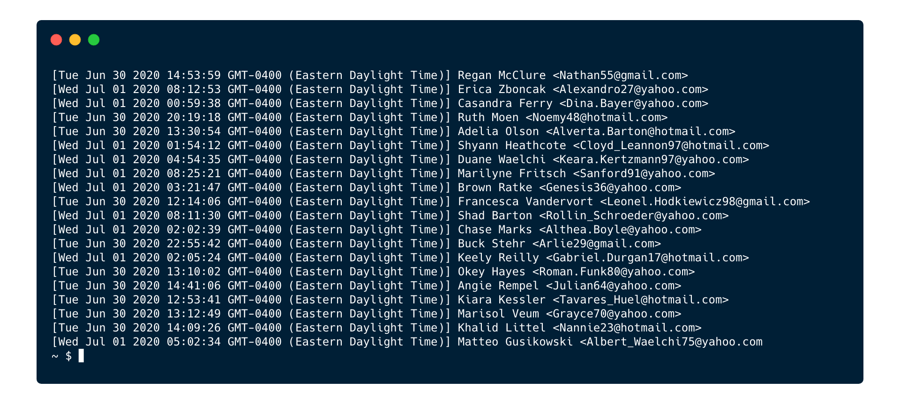

# Command Line Overview
The command line is a text interface for your computer. It's a program that takes in commands, which it passes on to the computer's operating system to run. From the command line, you can navigate through files and folders on your computer, execute functionality, and run different programs, applications, etc.  
Today we will leverage different command line skills to modifiy content of files dynamically.

## Common Commands

Being that we are going to be using the command line during this lesson, here are some commands as a reminder for interacting with the command line:

| Command | Example
| - | - |
| List Files and Folders | `ls -l` |
| List Files and Folders (including hidden) | `ls -la` |
| Output Text to Terminal | `echo "Hello!"` |
| Change Directory | `cd directory-name` |
| Make Directory | `mkdir directory-name` |
| Create File | `touch filename` |
| Remove File | `rm filename` |
| Remove Folder (along with files inside it) | `rm -rf foldername` |

## Let's Practice!

Our team has been given the task of fixing an application that displays everyone's favorite superheroes in the terminal. 

This is what the application looks like when it's working (though it will display a different, random superhero name each time):


To fix the application, we will need to make some adjustments, as well as create new files, using the command line.

By the end of this lesson, you will be able to:

* Navigate to different folders in the command line
* Create files in the command line
* Read files in the command line
* Sort file contents
* Find files from the command line

## Assemble!


Right now, the application does not run properly when the main command is executed. We received a report that the founding members of the Avengers are missing from the included in the `/heroes` folder.

To fix the issue of the missing heroes, we'll need to create the missing files inside the `/heroes` folder. Let's start by changing to that directory:

```bash
cd heroes
```

Once inside that folder, let's start creating a file for each missing Avenger. We can use the **touch command** to create a new blank file. Starting with Iron Man, use the following command:

```bash
touch iron-man.txt
```

This now generates a new blank file, `iron-man.txt` inside the `heroes` folder. However, this is only half the battle; we still need to add the text of the superhero's name inside that file. Fortunately, the **echo command** can help out here. `echo` commands require the use of quotes around the phrase that will be added to the file:

```bash
echo "Iron Man" > iron-man.txt
```

We have essentially output the text "Iron Man" to the terminal, then assigned the results of the `echo` command as the contents of the file `iron-man.txt`. This was achieved via **command piping**. The result of the command to the left of the `>` character will be placed in the file to the right of the `>` character.

> Tip: Using a single `>` character means that the file will always be completely replaced with the output of the command to the left of the `>` character. If you wanted to append the output to the existing data in a file, use `>>` instead. 

Let's verify that we have the proper phrase inside this file by using the **cat command**:

```bash
cat iron-man.txt
```

This will print out the following:

```
Iron Man
```

Perfect! One superhero down, four more to go. Repeat the same process with:

- Thor
- Wasp
- Ant-Man
- Hulk

A couple of reminders:

- You can `touch` multiple files at once if you would like. They will all still start out empty.
- You can chain multiple commands on the same line, executing them in order, by separating them with `&&`. For example: `touch thor.txt && echo "Thor" > thor.txt`

Let's expand on the use of `cat` to view all our new files. We can verify that each Avenger file looks correct by concatenating all of them via `cat`:

```bash
cat ant-man.txt hulk.txt iron-man.txt thor.txt wasp.txt
```

Now we want to save this list of heroes into a new file. To do so, we can pipe the results into a new file:

```bash
cat ant-man.txt hulk.txt iron-man.txt thor.txt wasp.txt > avengers.txt
```

Now we have created five new files inside the `/heroes` directory that include the missing Avengers. We can now move on to fixing the broken code for the application.

Before we move on, remember to navigate back one folder to the parent folder:

```bash
cd ..
```

## Viewing Files

Next, we've been told to verify that the Terms of Service file includes a section on Links.

If we wanted to view the Terms of Service for this application, we could do so via `cat`, but then the terminal would output a huge text block that is difficult to navigate. Rather than using `cat`, we can use the **less command** to navigate files more effectively.

```bash
less terms.txt
```

By using `less` we now have an interactive file viewer that can be navigated easily. Use the <kbd>Space</kbd> key to advance one screen at a time, or the arrow keys to move up and down one line at a time. Press the <kbd>q</kbd> key to quit.

We can even pass a file to the `less` command by piping it:

```bash
cat terms.txt | less
```

> Try using `less` on the other files in this application.

## Using Search to Debug

Wait! Our manager has asked us to reach out to the last 10 people who accessed this application and let them know that we are working on fixing it.

Fortunately, the application is still producing access logs that we can view. Let's use our file viewing skills along with sorting to determine who accessed the app most recently.

First let's take a quick look at the log:

```bash
cat logs/access.log
```



Okay, that's a lot of information and it doesn't appear to be sorted. Now we can sort along with `cat`:

```bash
cat logs/access.log | sort
```

Great, now the log is sorted by the date in ascending order (older to most recent). This is helpful, but we want to flip the sort order to descending order so we don't have to scroll:

```bash
cat logs/access.log | sort -r
```

Now we can see the last group of users that accessed the app. Since our manager required us to determine the last 10 people to access the site, we should save a copy of the log, sorted as a new file.

To do this, we can combine our commands we've used previously:

```bash
cat logs/access.log | sort -r > logs/access-sorted.log
```

Another problem solved!

## Fixing the App

Now that leaves just one more task, actually fixing the application. For this we need to locate a file in the source files folder, `/src`. Let's `cd` into that directory and immediately run `ls -la` to view all the files.

Whoa! That's a lot of files. I'm confused already! Fortunately, we've been told that the issue looked like a problem with JavaScript. Let's find all the `.js` files located in this folder using the `find` command:

```bash
find . -type f -name "*.js" -print
```

<details><summary>What are the arguments to the <code>find</code> command?</summary>

| Argument | Explanation |
| -------- | ----------- |
| `find`   | The command we're running |
| `.`      | The directory to start in; `.` means the current directory. |
| `-type f` | List only files (not directories) |
| `-name "*.js"` | List only entries that end in ".js" |
| `-print` | Output the results | 
</details>

Oh, cool! There are only 2 JavaScript files:

- `./locale/en.js`
- `./display.js`

It's really handy to quickly locate certain types of files using the wildcard `*` operator. The `locale` folder looks like it handles translation so I don't think we need to look there. Let's check out the `display.js` file using `less`:

```bash
less display.js
```

Ah! Here we go, this is the code for the application!

To make changes to this file, let's open it in our code editor, Visual Studio Code:

```bash
code display.js
```

Just looking at this code, **I see the issue! It's on line 10.** 

Currently the code shows:

```js
return data;
```

This line of code should return `response`, not `data`. So let's change line 10 to:

```js
return response;
```

Once you've made that change in VS Code, press <kbd>Cmd ⌘</kbd> <kbd>S</kbd> to save the file.


## Let's Run It!

Great job! We've now fixed the application code and are ready to run it. Since we were in the `/src` folder during that update, let's **`cd ..` back one level** to get back to the main project folder.

First, we have to set up our application code by running `npm install`

Now if we run `npm run start`, we should see the application running and a random super hero being displayed in the terminal!
