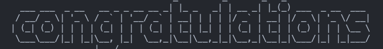

# Node Overview

Welcome to the back end! JavaScript was initially created only for interaction in the browser (the "front end"). With Node.js however, we can run JavaScript on the back end (servers) too. This makes JavaScript useful as a "full-stack" language, both in the browser and on the server.

Many programming languages have a "package manager" associated with them. Package managers help developers when they need to install external libraries and tools for building servers, testing code, and much more. Node's _de facto_ package manager is [NPM](https://www.npmjs.com).

In this lesson you will:

- learn how to create new projects with NPM
- leverage Node's ecosystem to connect files to each other

By the end of this you will be ready to publish your own packages to NPM if you want!

## Creating a package.json file

By now you may have seen a number of `package.json` files in various modules. Node package manager (npm), the package manager for our node projects, uses this file to find out more about what we're building and what we need to install to get it all to work.

## How to use the Node Package Manager

### Why Npm Is Important

Being able to access a library of code that has already been used will allow you to implement your project much faster. Also, letting npm manage your code's _dependencies_ (other libraries it needs to execute) makes it much easier to share your code.

### What npm install does
```bash
npm install
```
```
npm i
```
Both these commands will do the same thing. The command `npm install` will download packages and its dependencies. By default `npm install` will install all modules listed as dependencies in the package.json we've created. This will then generate our `node_modules`. All the dependencies we've installed will go to our local `node_modules` folder which has been generated when we did `npm install`. 

### Content

What is [npm](<https://en.wikipedia.org/wiki/Npm_(software)>)?
`npm` is a package manager for Node.js and JavaScript. _Packages_, or _libraries_, are bits of code that developers can re-use in their own projects.

One of the best features of Node.js is that it is _lightweight_; that is, Node itself provides minimal functionality. Most things are done with _modules_. npm packages are an example of [Modules](https://en.wikipedia.org/wiki/Modular_programming), which is a concept we see across many languages and frameworks.

npm was installed when node.js was installed. To check which version you have installed, run the following command.

```bash
npm -v
```

To output the help page, run the following command:

```bash
npm -h
```

### Initializing npm

When starting a new project you can use node command line interface to create a new package that will serve as a node project. Run the `npm init` command and it will walk you through initializing a node package, ultimately creating a `package.json` file. The interactive prompt will ask some questions about what you are working on and when you're done a new file is created that contains metadata about your project. If we were to use `npm init` to create a package with the name `npm-test` the `package.json` creation would be:

```json
{
  "name": "npm-test",
  "version": "1.0.0",
  "description": "",
  "main": "index.js",
  "scripts": {
    "test": "echo \"Error: no test specified\" && exit 1"
  },
  "author": "",
  "license": "ISC"
}
```

The json file for your project will have properties and corresponding values that relate to your package. If you plan on publishing the package to the npm registry, the name and version properties are *required*. The fields that are generated by `npm init` by default are:

- `name` is a title for your project
- `version` is the current version of your project, using semantic versioning in the *major.minor.patch* syntax
- `description` is a overview of what your project does and helps with others discovering your project when searching strings in the npm registry
- `main` tells what file, relative to the root folder, serves as the primary script for the project when you run it
- `scripts` allows you to set custom scripts that can be ran at various points in the project's life cycle
- `author` is for crediting who created the package
- `license` denotes what kind of licensure a package has, which allows other people to know how they are allowed to use it

Installed node packages that your project brings in would be represented in a `dependencies` property:

```js
"dependencies": {
    "big": "^0.5.2",
    "underscore": "^1.10.2"
}
```

There are many more `package.json` properties and they can all be found within [npm's documentation](https://docs.npmjs.com/files/package.json).

- [Node Source: Basics of package.json](https://nodesource.com/blog/the-basics-of-package-json-in-node-js-and-npm/)

_Pro Tip:_ If you want to create a `package.json` without having to answer all the questions, you can type:

```bash
npm init -y
```

You will want to create a `package.json` wherever you are creating a new Node.js project. Where you want to use the packages you are installing, that's where you create the `package.json` file.

## Installing Packages and Node Modules

Once you have a `package.json`, it's time for you to install some packages. There are a few different ways you can install and knowing the difference between them can be one of the determining factors for deploying or sharing a project easily!

### Installing packages

To install a module that you will be using in your application, you'll have to use `npm install module_name`.

If we run the command `npm install pad`, you'll see npm downloading the module. [Pad](https://www.npmjs.com/package/pad) is a very simple tool that pads strings to the left and right.

After installing `pad`, the package.json file looks something like this:

```json
{
  "name": "npm-test",
  "version": "1.0.0",
  "description": "",
  "main": "index.js",
  "scripts": {
    "test": "echo \"Error: no test specified\" && exit 1"
  },
  "author": "",
  "license": "ISC",
  "dependencies": {
    "pad": "^1.0.0"
  }
}
```

Notice the new `dependencies` section at the bottom of the file. All the packages that you install will be added there. Also, if you look in the folder that contains your `package.json`, you'll notice a new folder named `node_modules`. This is where the code for `pad` was added (and any other libraries it depends on).

> Note on Developer Dependencies: Sometimes there are packages that are very useful while developing an application, but you don't want to deploy to production because they're both irrelevant in production and they take up space. npm has a flag that allows you to make that distinction: `--save-dev`.

Let's install a package that is useful for capturing input when a user types in a the command line called [Prompt-Sync](https://www.npmjs.com/package/prompt-sync).

To install Prompt-Sync, run the following command:

`npm install prompt-sync`

After the installation, the package.json looks something like this:

```json
{
  "name": "npm-test",
  "version": "1.0.0",
  "description": "",
  "main": "index.js",
  "scripts": {
    "test": "echo \"Error: no test specified\" && exit 1"
  },
  "author": "",
  "license": "ISC",
  "dependencies": {
    "pad": "^4.2.0",
    "prompt-sync": ""
  }
}
```

## node_modules

After you've installed a package, you'll notice a new folder called `node_modules`. You won't want to push up this folder to GitHub as it's unnecessary. Instead, when someone else clones your repository, they will simply need to run `npm install` and it will install all the packages that are a part of your `package.json` in their `node_modules` directory.

To ignore those files, create a new file called `.gitignore` (with the `.` or else it won't work!) and add the following line to it:

```gitignore
node_modules/
```

This will ignore `node_modules/` and disallow it from being pushed up.

_Note:_ If you've already pushed up `node_modules`, adding it to `.gitignore` won't remove it from your repository. You'll have to run `git rm node_modules`, commit that, then re-run `npm install`, add `node_modules/` to `.gitignore`, and re-commit.

## Using Prompt-Sync
According to the documentation, we need to make sure to require our newly installed package at the top of our `prompt.js` file.

```js
const prompt = require('prompt-sync')();
```

Now everytime we use the `prompt` key word, we have access to that library and package.  
Let's add on to our code so we can see it run.

```js
prompt('What is your name?' )
```
To run our file, all we need to type in the terminal is:

```bash
node prompt.js
```

When we run our `prompt.js` in the terminal we get the prompt to enter our name. That's great, but let's change our code so we can utilize the response the user enters. To do that, we can store it in a variable. Let's modfiy the code and add a `console.log` to see if it worked.

```js
const name = prompt('What is your name?' )
console.log(name)
```

Now the user prompt is stored in a variable and we can access it anytime we call `name`.  

## Figlet
Let's add another package that will print our name in a nicer and more ***stylish*** way. We will install [Figlet](https://www.npmjs.com/package/figlet).  
Just like the other packages we installed, we will run the same command this time with `figlet` at the end.

```bash
npm install figlet
```
Now our dependencies should look like the following:
```js
"dependencies": {
    "figlet": "^1.5.2",
    "prompt-sync": "^4.2.0"
  }
```

Perfect! Let's go ahead and use it in our application. Very similar to the `prompt-sync` library, we need to `require` it at the top.
```js
const figlet = require('figlet');
```

Now let's utilize this variable.
```js
figlet(messsage, function(err, data) {
    console.log(data)
})
```
Note the syntax is a little different from `prompt-sync`.  
`Figlet` takes in two parameters:  
1. First it's the message or text that will be converted into ASCII art. In this case, we will pass in the `name` variable as that's the `string` we want to convert.
2. The second argument is an anonymous function that has two parameters, `err` to handle errors, and `data` which is the converted text in ASCII art.  

Let's go ahead and create our `figlet` function utilizing our data. Let's pass in the `name` variable as the first arugment, and then we will `console.log` the `data` argument. It should result in the `name` variable printing out in ASCII art.

```js
figlet(name, function(err, data) {
    console.log(data)
})
```

Run the application using `node prompt.js`.  



Congratulations! We learned how to navigate and utilize the command line, how Node works, and how to start using different NPM packages!
